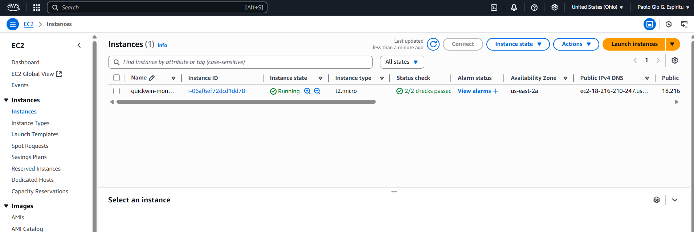
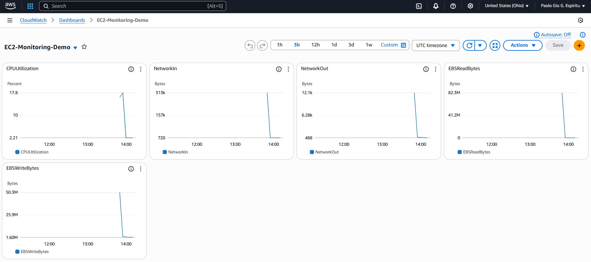
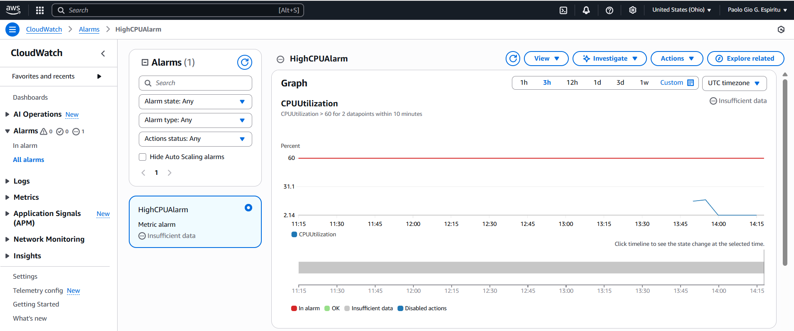

# 🚀 EC2 Monitoring with CloudWatch Dashboard 
## 👤 Owner **Paolo Gio Espiritu**

## ✅ Step-by-Step Guide

### 🖥️ Step 1: Launch a Free Tier EC2 Instance

1. **Log in** to the [AWS Management Console](https://console.aws.amazon.com).
2. Go to **EC2 > Instances > Launch Instance**.
3. Choose **Amazon Linux 2023 (Free Tier eligible)**.
4. Select the **t2.micro** instance type (included in Free Tier).
5. Click **Next** until you reach **Configure Security Group**, then:
   - Add rules to allow:
     - SSH (port 22)
     - HTTP (port 80)
     - HTTPS (port 443)
6. Under **Key pair (login)**:
   - Create a new key pair and name it: `quickwin-monitoring`
   - Download the `.pem` file and store it safely.
7. Click **Launch Instance** and wait for it to initialize.

> ℹ️ Tip: Naming your key pair and instance with a common prefix helps keep things organized!

---

### 🔍 Step 2: Enable CloudWatch Monitoring

1. During instance setup, **tick** the checkbox under **Monitoring**:
   - ✅ *Enable CloudWatch detailed monitoring*
2. (Optional: Skip this for Free Tier basic metrics – but enabling it provides more granularity.)
3. Wait for your EC2 instance to show as `running`.

---

### 🔐 Step 3: Connect and Simulate Activity

1. Connect to your EC2 instance via **EC2 Instance Connect** or your terminal using SSH:
   ```bash
   ssh -i "quickwin-monitoring.pem" ec2-user@<your-ec2-public-ip>
   ```
   
2. Simulate CPU activity to generate some interesting metrics:
   ```bash
   sudo yum install -y stress
   stress --cpu 2 --timeout 60
   ```

> 🧪 Tip: Simulating CPU load helps visualize spikes on your dashboard—great for testing alarms too!
 
---

### 📊 Step 4: Create Your CloudWatch Dashboard
1. Go to CloudWatch > Dashboards.
2. Click Create dashboard and name it: `EC2-Monitoring-Demo`.
3. Click Add widget and select Line chart (or any format you like).
4. Add the following metrics one by one as separate widgets:
   - `EC2 > Per-Instance Metrics > CPUUtilization`
   - `EC2 > Network > NetworkIn`
   - `EC2 > Network > NetworkOut`
   - `EC2 > Disk > DiskReadBytes`
   - `EC2 > Disk > DiskWriteBytes`

> 🎨 Tip: Customize each widget’s title, color, and layout. A clean layout makes the dashboard easier to read at a glance.

---

### 🔔 Step 5: Set a Basic Alarm (Bonus)
1. Go to CloudWatch > Alarms > Create Alarm.
2. Select the metric: `CPUUtilization` for your EC2 instance.
3. Set the alarm condition:
   - Trigger if CPU utilization is greater than 60% for 2 consecutive periods (5 minutes each).
4. Choose actions:
   - (Optional) Skip for now or set up SNS topic for email notifications later.
5. Name the alarm: `HighCPUAlarm`.
6. Click Create Alarm.

> 🔕 Reminder: You can always revisit your alarm settings later to fine-tune thresholds or notification settings.

## 🖼️ Project Screenshots

<!-- Figure 1: EC2 instance creation -->
  
*Figure 1: EC2 instance successfully created and running.*

<!-- Figure 2: CloudWatch Dashboard -->
  
*Figure 2: “EC2-Monitoring-Demo” dashboard showing CPU, Network, and Disk metrics.*

<!-- Figure 3: High CPU Alarm -->
  
*Figure 3: CloudWatch alarm “HighCPUAlarm” configured to trigger when CPU > 60% for 2 periods.*

## 🧠 Skills Demonstrated

- ✅ EC2 provisioning and management
- ✅ CloudWatch dashboard and metric configuration
- ✅ Alarm and threshold-based monitoring
- ✅ Simulating CPU load for testing
- ✅ Infrastructure observability best practices

## 📌 Summary
This project serves as a practical foundation in AWS monitoring and alerting, showcasing the ability to proactively manage and visualize infrastructure health using native AWS services.

## 🏅 Credits
Special thanks to `Sir James Santos` and `Master Cloud Training` for the inspiration and foundational lessons in this guide.
This walkthrough is a personalized adaptation based on concepts taught in his eBook:
📘 Build your First Cloud Portfolio
